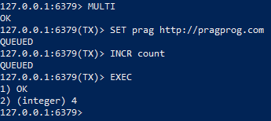

# Info de la materia: ST0263 Tópicos Especiales en Telemática
#
# Estudiante(s): Ana Sofia Arango Gonzalez, asarangog@eafit.edu.co y Camila Mejia Muñoz, cmejiam10@eafit.edu.co
#
# Profesor: Edwin Nelson Montoya Munera, emontoya@eafit.edu.co
#
# Avance Proyecto 1
#
# 1. Breve descripción de la actividad
Implementación de clúster en multi nodo con redis en una máquina EC2 de AWS con configuraciones de replicación, particionamiento y acceso distribuido, cumplimiento de actividades propuestas por el libro Seven Databases in Seven Weeks, operaciones CRUD en Python sobre la base de datos redis y simulación de aplicación que utiliza redis como MOM.
#

## 1.1. Que aspectos cumplió o desarrolló de la actividad propuesta por el profesor (requerimientos funcionales y no funcionales)
Se logró el objetivo de conectar redis con AWS y ejecutar funciones de redis, en redis-server.  
Se realizó el capítulo 8 completo con todos sus ejercicios e indicaciones (Pantallazos adjuntados).  
Se instaló correctamente el modo multi nodo redis en cluster con ayuda de Docker y sus respectivos nodos.

## 1.2. Que aspectos NO cumplió o desarrolló de la actividad propuesta por el profesor (requerimientos funcionales y no funcionales)
No se logró crear la aplicación CRUD con Python por problemas de conexión y no se encontró una solución.  
No se realizó la simulación de la aplicación que usará redis como MOM.

# 2. Información general de diseño de alto nivel, arquitectura, patrones, mejores prácticas utilizadas.
Se utilizó Docker y redis-cli.

# 3. Descripción del ambiente de desarrollo y técnico: lenguaje de programación, librerias, paquetes, etc, con sus numeros de versiones.
Docker 20.10  
Redis 7.0.4  
Python 3.10.6

## Como se compila y ejecuta.
1. En el archivo de texto "docker-compose.yml" se configuran las especificaciones para la creación de cada nodo.
2. En una terminal se ejecuta el comando `sudo docker compose up`
3. En otra terminal se ejecuta el comando `sudo docker ps` este nos mostrará los contenedores con los nodos que están corriendo y utilizaremos los Containers ID.
4. Para conectarnos a un nodo se ejecuta el comando `sudo docker exec -it <Container ID> bash` con el respectivo Container ID. Luego se ejecuta el comando `redis-cli -a <password>` con su respectiva contraseña.
5. Para verificar la conexión se puede ejecutar el comando `ping` y deberá devolver "PONG".
6. A partir de aquí ya se pueden realizar CRUDs con comandos redis.
7. Para realizar CRUDs en Python se ejecuta el archivo "main.py" con el comando `python3 main.py`

## Detalles del desarrollo.
### Punto 1 y 2
Para la instalación de Redis creamos un Docker en la máquina EC2 de AWS Academy, donde poseemos 3 espacios: 1 maestro y 3 réplicas, donde el maestro puede leer y escribir y los esclavos solo pueden leer.  
Para realizar las actividades CRUD propuestas por el libro, iniciamos el Docker e ingresamos al nodo maestro:

 
Luego, comenzamos a seguir los pasos propuestos:   
  
  
  
  
  
  
  
  
  
  
  
  
  
  
  
  
  
  
  
### Punto 3
Para comenzar se instaló Python y se conectó a la base de datos de Redis. Luego procedimos a realizar el código en Python para realizar las operaciones de Create y Read.  

### Punto 4
Esta es la creación de los múltiples nodos:  
  
Para comprobar el acceso distribuido se generaron los siguientes datos desde el nodo maestro:  
  
Luego, se accedió a una de las replicas y se obtuvo la información de ese dato:  
  
Para comprobar la tolerancia a fallos se ‘detuvo’ una de las replicas y se busco la misma información en otro nodo diferente:  
  

## Detalles técnicos
El archivo "docker-compose.yml" es para configurar las especificaciones de los nodos. El archivo "main.py" es el que realiza el CRUD en Python sobre la base de datos redis.

## Descripción y como se configura los parámetros del proyecto (ej: ip, puertos, conexión a bases de datos,variables de ambiente, parámetros, etc)
En el archivo "docker-compose.yml" se configuran los parametros para la creación de nuevos nodos. Se le asigna un puerto, un modo, una contraseña y en caso de ser replica cual es su nodo maestro.

# 4. Descripción del ambiente de EJECUCIÓN (en producción) lenguaje de programación, librerias, paquetes, etc, con sus numeros de versiones.
Docker 20.10  
Redis 7.0.4  
Python 3.10.6

# IP o nombres de dominio en nube o en la máquina servidor.
IP elástica de la máquina servidor: 44.207.29.98

## Descripción y como se configura los parámetros del proyecto (ej: ip, puertos, conexión a bases de datos, variables de ambiente, parámetros, etc)
Se puede modificar el archivo "docker-compose.yml" para crear nuevos nodos.

## Como se lanza el servidor.
Para lanzar el servidor se ejecuta el comando `sudo docker compose up`

## Una mini guia de como un usuario utilizaría el software o la aplicación
1. En el archivo de texto "docker-compose.yml" se configuran las especificaciones para la creación de cada nodo.
2. En una terminal se ejecuta el comando `sudo docker compose up`
3. En otra terminal se ejecuta el comando `sudo docker ps` este nos mostrará los contenedores con los nodos que están corriendo y utilizaremos los Containers ID.
4. Para conectarnos a un nodo se ejecuta el comando `sudo docker exec -it <Container ID> bash` con el respectivo Container ID. Luego se ejecuta el comando `redis-cli -a <password>` con su respectiva contraseña.
5. Para verificar la conexión se puede ejecutar el comando `ping` y deberá devolver "PONG".
6. A partir de aquí ya se pueden realizar CRUDs con comandos redis.
7. Para realizar CRUDs en Python se ejecuta el archivo "main.py" con el comando `python3 main.py`

# 5. Otra información que considere relevante para esta actividad.

# Referencias:
## https://www.oreilly.com/library/view/seven-databases-in/9781680505962/f_0055.xhtml#d24e41269

#### versión README.md -> 1.0 (2022-agosto)